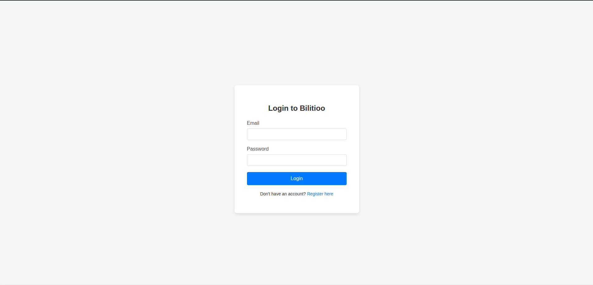
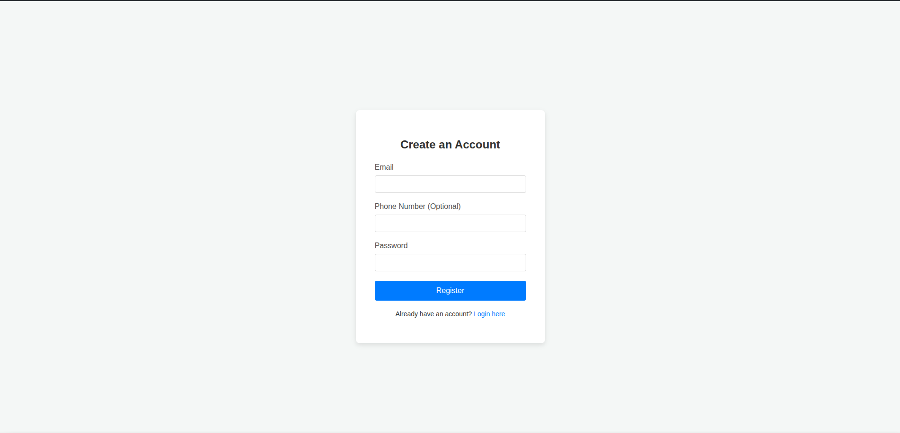
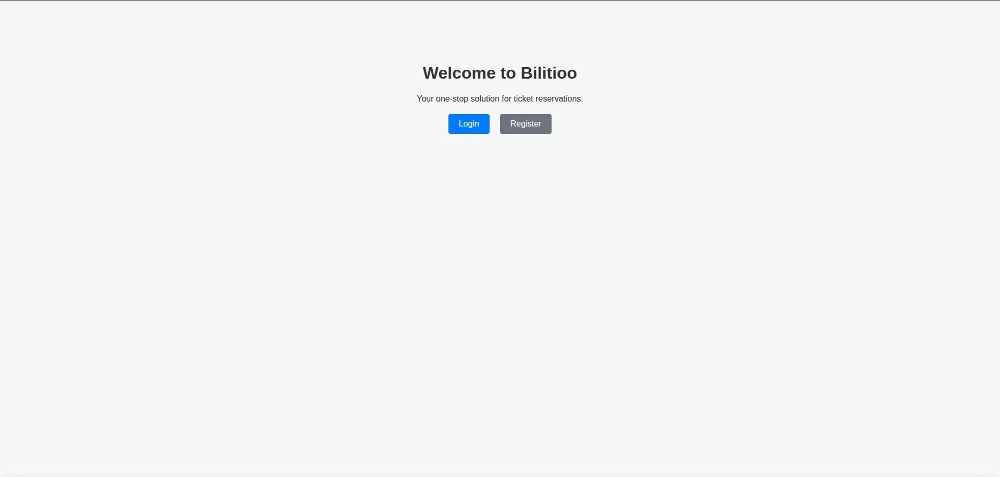
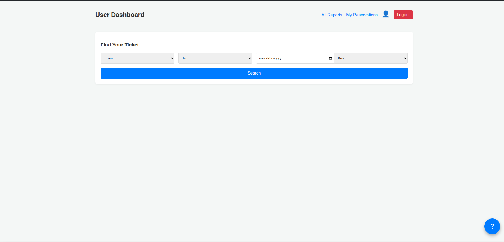
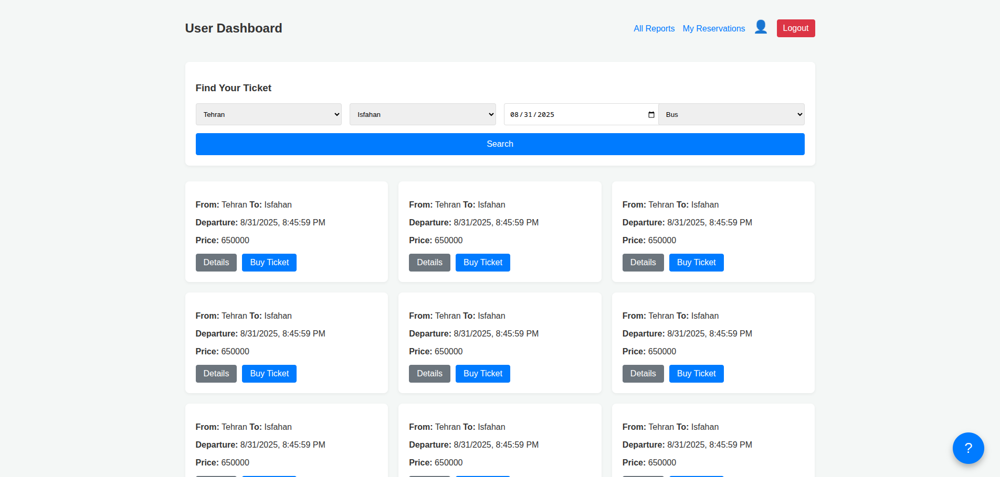
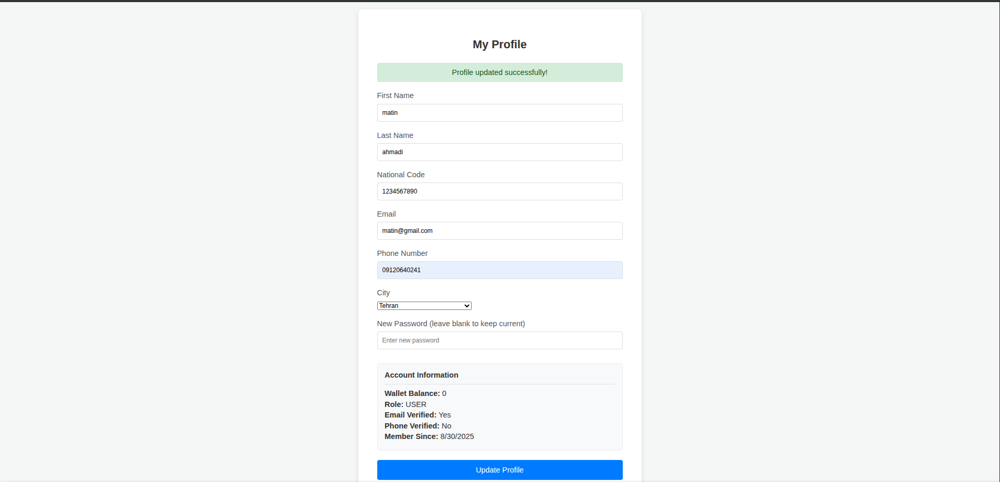
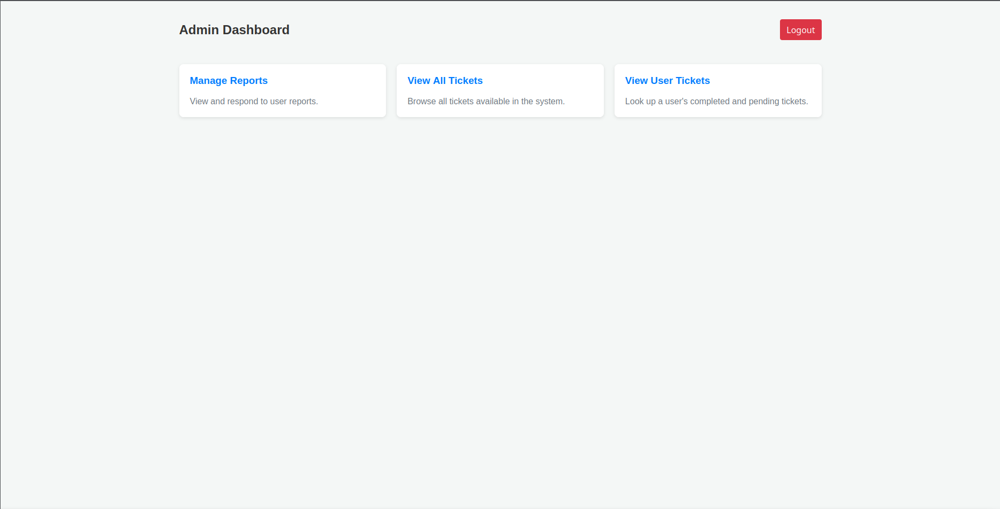
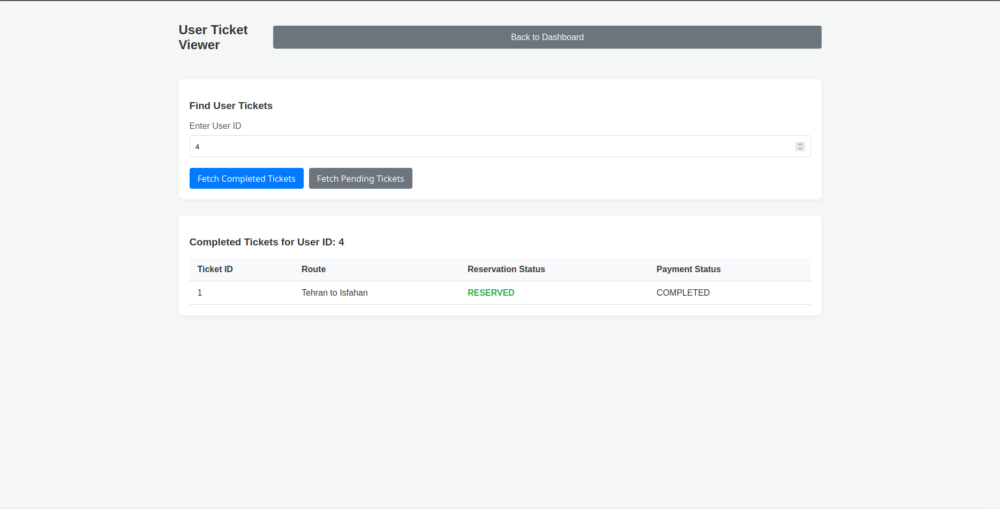
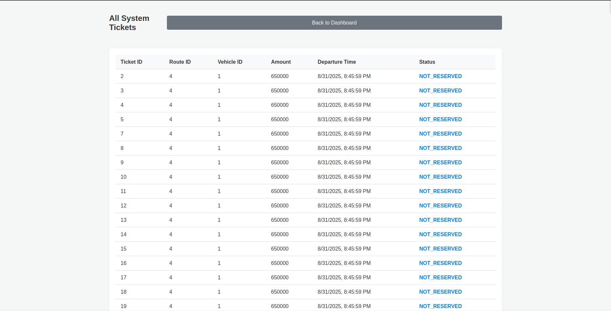

# Bilitioo Frontend

A React-based frontend application for the Bilitioo ticket reservation system. This application provides a complete user interface for booking tickets, managing reservations, and handling user support requests.

## 🚀 Getting Started

### Prerequisites

- Docker and Docker Compose installed on your system
- Make utility installed
- Git for cloning repositories

### Installation & Setup

**Run the complete setup**:
   ```bash
   make all
   ```

This single command will:
- Download the backend dependency (`bilitioo-backend`)
- Run the backend's Makefile to set up the backend services
- Build the frontend Docker image
- Start the frontend container

### Available Make Commands

| Command | Description |
|---------|-------------|
| `make all` | Complete setup: get dependencies, run backend, build and start frontend |
| `make build` | Build the Docker image for the frontend |
| `make up` | Start the frontend container (builds first if needed) |
| `make down` | Stop and remove the frontend container and volumes |
| `make logs` | View frontend logs in real-time |
| `make reset` | Full reset: stop, remove, and restart containers |
| `make get-dep` | Download external dependencies |
| `make run-dep-makefile` | Run the backend's Makefile |

## 🏗️ Architecture

The application follows a modern React architecture with:

- **React Router** for navigation
- **Axios** for API communication
- **Component-based structure** with reusable modals and widgets
- **Role-based routing** (USER/ADMIN access control)
- **Local storage** for authentication tokens

### Project Structure

```
frontend/src/
├── components/          # Reusable UI components
│   ├── Login.js
│   ├── Register.js
│   ├── Home.js
│   ├── PaymentModal.js
│   ├── CancelModal.js
│   ├── SupportWidget.js
│   └── ...
├── pages/              # Page components
│   ├── UserDashboard.js
│   ├── AdminDashboard.js
│   ├── Profile.js
│   ├── TicketDetails.js
│   └── ...
├── App.js             # Main application component
└── index.js           # Application entry point
```

## 📱 Features

### User Features
- **Authentication**: Login/Register with email verification
- **Ticket Search**: Search by origin, destination, date, and vehicle type
- **Ticket Booking**: Reserve and purchase tickets
- **Payment Processing**: Multiple payment methods (Wallet, Credit Card, etc.)
- **Reservation Management**: View, pay for, and cancel reservations
- **Profile Management**: Update personal information and view wallet balance
- **Support System**: Submit and track support requests

### Admin Features
- **Dashboard**: Overview of system operations
- **Report Management**: View and respond to user reports
- **Ticket Management**: View all system tickets
- **User Ticket Lookup**: Search user's completed/pending tickets
- **Reservation Status Management**: Update reservation statuses

## 🌐 API Integration

The frontend communicates with the backend at `http://localhost:3000`. Here's a comprehensive overview of all API endpoints used:

### Authentication APIs

| Endpoint | Method | Request | Response | Used In |
|----------|---------|---------|----------|---------|
| `/sign-in` | POST | `{email, phone_number, password}` | Success message | Register.js |
| `/log-in` | POST | `{email, password}` | `{access_token, user: {role}}` | Login.js |

### User Profile APIs

| Endpoint | Method | Request | Response | Used In |
|----------|---------|---------|----------|---------|
| `/profile` | GET | Headers: `Authorization: Bearer <token>` | User profile data with wallet | Profile.js, MyReservations.js |
| `/profile` | PUT | Profile update object | Success confirmation | Profile.js |
| `/city` | GET | Headers: `Authorization: Bearer <token>` | Array of cities | Profile.js, UserDashboard.js |

### Ticket & Search APIs

| Endpoint | Method | Request | Response | Used In |
|----------|---------|---------|----------|---------|
| `/search-tickets` | POST | `{origin_city_id, destination_city_id, departure_date, vehicle_type}` | Array of available tickets | UserDashboard.js |
| `/ticket-detail/:id` | GET | Headers: `Authorization: Bearer <token>` | Detailed ticket information | TicketDetails.js |

### Reservation & Payment APIs

| Endpoint | Method | Request | Response | Used In |
|----------|---------|---------|----------|---------|
| `/reservation` | POST | `{tickets: [ticket_ids]}` | Reservation confirmation | UserDashboard.js, TicketDetails.js |
| `/allReservation` | GET | Headers: `Authorization: Bearer <token>` | Array of user reservations | MyReservations.js |
| `/payment` | POST | `{payment_id, type, payment_status, reservation_status}` | Payment confirmation | MyReservations.js |

### Cancellation & Penalties APIs

| Endpoint | Method | Request | Response | Used In |
|----------|---------|---------|----------|---------|
| `/ticket-penalties/:ticket_id` | GET | Headers: `Authorization: Bearer <token>` | `{penalty_text, befor_day, after_day}` | MyReservations.js |
| `/penalty/:ticket_id` | PUT | Headers: `Authorization: Bearer <token>` | Cancellation confirmation | MyReservations.js |

### Support & Reports APIs

| Endpoint | Method | Request | Response | Used In |
|----------|---------|---------|----------|---------|
| `/report` | POST | `{reservation_id, request_type, request_text}` | Report submission confirmation | SupportWidget.js |
| `/reports` | GET | Headers: `Authorization: Bearer <token>` | Array of user reports | SupportWidget.js, AllReports.js |

### Admin APIs

| Endpoint | Method | Request | Response | Used In |
|----------|---------|---------|----------|---------|
| `/admin/reports` | GET | Headers: `Authorization: Bearer <token>` | All system reports | AdminReports.js |
| `/admin/reports/answer` | PUT | `{id, response_text}` | Update confirmation | AdminReports.js |
| `/admin/reports/manage` | PUT | `{reserevation_id, to_status_reservation}` | Status update confirmation | AdminReports.js |
| `/admin/tickets` | GET | Headers: `Authorization: Bearer <token>` | All system tickets | AdminTickets.js |
| `/admin/users/:id/completed-tickets` | GET | Headers: `Authorization: Bearer <token>` | User's completed tickets | UserTicketsViewer.js |
| `/admin/users/:id/notcompleted-tickets` | GET | Headers: `Authorization: Bearer <token>` | User's pending tickets | UserTicketsViewer.js |

## 🔐 Authentication & Authorization

The application uses JWT-based authentication:

1. **Login Process**: User credentials are sent to `/log-in`
2. **Token Storage**: Access token stored in `localStorage`
3. **Route Protection**: `PrivateRoute` component checks for valid tokens
4. **Role-based Access**: Different dashboards for USER and ADMIN roles
5. **Auto-redirect**: Unauthenticated users redirected to login

### Route Structure

```
Public Routes:
├── / (Home)
├── /login
└── /register

User Routes (Requires Authentication):
├── /dashboard
├── /profile
├── /tickets/:id
├── /reservations
└── /reports

Admin Routes (Requires ADMIN role):
├── /admin/dashboard
├── /admin/reports
├── /admin/tickets
└── /admin/user-tickets
```

## 🎨 UI Components

### Modal Components
- **PaymentModal**: Handle payment processing with multiple payment types
- **CancelModal**: Display penalty information and confirm cancellations
- **AnswerReportModal**: Admin interface for responding to user reports
- **ManageTicketModal**: Admin interface for updating reservation statuses

### Widget Components
- **SupportWidget**: Floating support button with integrated reporting system

## 🐳 Docker Configuration

The application runs in a containerized environment. The Docker setup is managed through the `docker-compose.yml` file and controlled via the Makefile.

### Container Management
- Frontend runs on the configured port
- Automatic container restart policies
- Volume mounting for development
- Network configuration for backend communication

## 🛠️ Development

### Local Development Setup

1. Ensure backend is running on `http://localhost:3000`
2. Use `make up` to start the frontend container
3. Use `make logs` to monitor application logs
4. Use `make down` when stopping development

### Environment Variables

The application uses hardcoded API URL (`http://localhost:3000`). For production deployment, consider implementing environment-based configuration.

## 🔧 Troubleshooting

### Common Issues

1. **Backend Connection**: Ensure backend is running before starting frontend
2. **Port Conflicts**: Check if port 3000 is available for backend
3. **Container Issues**: Use `make reset` to completely restart containers
4. **Dependency Issues**: Run `make get-dep` to refresh dependencies

### Logs and Debugging

```bash
# View frontend logs
make logs

# Check container status
docker compose ps

# Access container shell
docker compose exec frontend sh
```

## 📝 API Documentation

For detailed backend API documentation, refer to the backend repository's documentation. The backend provides:

- RESTful API endpoints
- JWT authentication
- Role-based authorization  
- Database integration
- Payment processing
- Penalty calculations

## 🖼️ Application Screenshots

<details>
<summary><b>🔐 Authentication</b></summary>
<br>

**Login & Register**




</details>

<details>
<summary><b>📷 User Panel</b></summary>
<br>

**Home & Search**



**Bookings & Payments**


**Profile & Settings**


</details>

<details>
<summary><b>🔑 Admin Panel</b></summary>
<br>

**Dashboard**


**User & Travel Management**



**Settings**


</details>

## 📄 License
MIT License © 2025 [Matin](https://github.com/Matltin), [Reyhon](https://github.com/ryhn-mir) 🍀
---

**Note**: This frontend application requires the corresponding backend service to be running. Always start the backend first using the dependency management system built into the Makefile.
